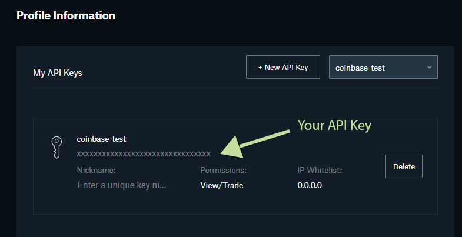

# coinbase-pro-average-down

A simple bot that automates averaging down the cost of your crypto asset. (i.e. every time the price of ETH falls 5% buy $200 worth)

## Disclaimer
This is not an endorsement of any strategy or this program itself. This code is, open source, and you assume all risks from its use

## How?

Simply put, you can specify a percentage and when the crypto you select falls from a relative peak or recent purchase price by that fixed percentage it will trigger an order to buy more. 


## Requirements

1. You need to have NodeJS. Download the latest version for your device here: https://nodejs.org/en/download/

2. You need to have git installed. Your computer likely already has this.

3. You need to set up an account on coinbase pro. (https://pro.coinbase.com)


## Steps
 
### I) Clone the project
1.  Open your preferred terminal program (`Command Prompt` on Windows and `Terminal` on MacOS) and run the following:
    ```shell
    git clone https://github.com/abir-taheer/coinbase-pro-average-down.git
    ```
    This will download the project code onto your computer
2. Enter the project directory:
    ```shell
    cd coinbase-pro-average-down
    ```
3. Download dependencies (make sure you have node installed):
    ```shell
    npm install
    ```
   
### II) Get your api keys
1. Sign in to https://pro.coinbase.com
2. `(Optional)` Make a separate portfolio for this app. This will help you isolate any actions taken by this app in particular.
    1. To make a separate portfolio, go to https://pro.coinbase.com/portfolios and click on where it says `Create` on the top left.
    2. Give this portfolio a name
    3. Deposit the amount of USD that you want this bot to have access to into this portfolio from your default portfolio or from your bank
3. Go to the api keys page: https://pro.coinbase.com/profile/api
   1. Next to the `+ New API Key` button, make sure you have the correct portfolio selected if you created a new one
   2. Click on the `+ New API Key` button
   3. Give it a nickname
   4. Give it permissions to `View` and `Trade`
   5. The passphrase field has a value. You can leave it as-is or enter your own. Make sure to write it down somewhere.
   6. For the IP whitelist, enter your current IP address (google: `what is my ip address`)
    * If you are running on a remote server enter the ip address of the server. 
    * If your ip address will change often, you can set the value to `0.0.0.0` but be careful because if your api key is stolen, anyone will be able to use it.
   7. Click `Create API Key`
   8. You'll be presented with an `API Secret`. This is important too, write this down somewhere.
   9. Close out the tab, and you'll see something like this: 
   
   10. The arrow is pointing to your api key. Write this down somewhere as well.
   
### Configure the app
1. Go back to your terminal and make sure you're at the root of the project directory (you should be if you haven't touched it after installing dependencies)
2. There's a file in the project called `example.env`, rename it to `.env` with the following command
   ```shell
   mv .example.env .env
   ```
3. Now edit the file in your preferred text editor. On Windows you can open the file in notepad by doing:
   * To open in Notepad on Windows: 
   1. ```shell
      notepad .env
      ```
   * To open in TextEdit on MacOS:
   1. ```shell
      open -a TextEdit .env
      ```
   
4. Add your API Key, Secret, and Passphrase in the places indicated
5. Change the trading settings to your desires or leave them as-is if you're fine with them
6. Save the file `Cmd + S` on MacOS or `Ctrl + S` on Windows

### Running the app
To run the app simply use the following command: 
```shell
npm start
```